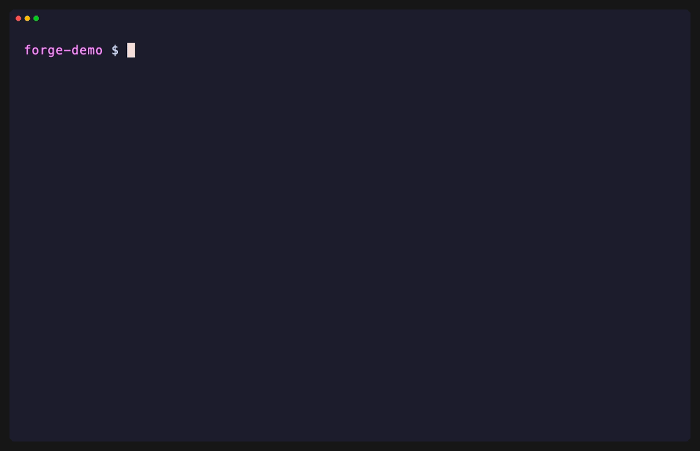

# claude-forge

[](./LICENSE)
[](https://docs.anthropic.com/en/docs/claude-code)
[](https://www.python.org/)
[](#how-it-works)

Drive [Laravel Forge](https://forge.laravel.com) from **Claude Code** — manage servers, sites,
deployments, databases, SSL, daemons, scheduled jobs, and env files in plain English. You bring
your own Forge API token; everything runs locally against the official Forge API.

```
You:  /forge deploy my-app
       ↳ Claude resolves the server + site, shows a dry-run, you confirm, it deploys,
         then tails the deploy log.
```

## Demo



> Recorded against a local mock — **all data shown is fictional**. Reproduce it yourself with
> the harness in [`demo/`](./demo).

> **Heads up:** this tool acts on **your real Forge infrastructure**. Every mutating action
> (deploy, reboot, create, env changes…) is gated behind an explicit confirmation, but you are
> responsible for what you approve. Use a scoped API token.

---

## Install

### Option A — Claude Code plugin (recommended)

```
/plugin marketplace add webmavens/claude-forge
/plugin install forge@claude-forge
```

That's it — the `/forge` skill is now available and updates with the marketplace.

### Option B — one-line installer (no plugin system)

```
curl -fsSL https://raw.githubusercontent.com/webmavens/claude-forge/main/install.sh | bash
```

This copies the skill into `~/.claude/skills/forge`. Requires `python3` and `curl` (both ship on
macOS and most Linux). No third-party Python packages — standard library only.

---

## Connect your Forge account (one time)

1. Create a token at **forge.laravel.com → Account → API → Create API Token**.
   Scope it to what you need (e.g. read-only, or specific server permissions).
2. Authenticate. Run this in a **real terminal** (the prompt hides the token):

   ```
   python3 ~/.claude/skills/forge/forge.py auth
   ```

   Alternatives:
   - inline: `python3 .../forge.py auth <YOUR_TOKEN>`
   - env var: `export FORGE_API_TOKEN=<YOUR_TOKEN>` (skips the saved file entirely)

   > For a plugin install, the path is the plugin's skill directory — Claude knows it; just say
   > "authenticate to Forge" and follow the prompt.

The token is validated against `GET /user`, then stored at `~/.claude/forge/credentials`
(`chmod 600`). `auth --status` shows who you are; `logout` deletes it.

---

## Usage

Talk to Claude naturally, or call the helper directly:

```
python3 ~/.claude/skills/forge/forge.py servers list
python3 ~/.claude/skills/forge/forge.py sites list <server>
python3 ~/.claude/skills/forge/forge.py deploy run <server> <site> --yes
python3 ~/.claude/skills/forge/forge.py db create <server> --name myapp --yes
python3 ~/.claude/skills/forge/forge.py api GET /servers/<id>/sites/<site>/deployment-history
```

| Group | Actions |
|-------|---------|
| `servers` | `list`, `get`, `reboot` |
| `sites` | `list`, `get`, `create` |
| `deploy` | `run`, `log`, `script [--set]`, `quick-deploy on\|off` |
| `db` | `list`, `create` |
| `db-user` | `list`, `create` |
| `ssl` | `list`, `letsencrypt` |
| `daemon` | `list`, `create` |
| `job` | `list`, `create` (scheduler) |
| `env` | `get`, `set` |
| `api` | raw passthrough to any Forge endpoint |

Add `--json` to any read command for machine-readable output.

### Safety model

- **Reads** (`list`/`get`/`log`) run freely.
- **Mutations** (`deploy`, `reboot`, `create`, `env set`, …) refuse to act without `--yes`.
  Without it they print a `WOULD: …` dry-run and exit `2`, so Claude can confirm with you first.

### Rate limits

Forge sits behind Cloudflare (Error 1015). The helper automatically respects `Retry-After`
with exponential backoff. Account-wide sweeps (every site on every server) make many calls and
are paced — expect a couple of minutes on large accounts.

---

## What it can't do

Forge's API runs commands (site commands, recipes) but **does not return their stdout**, and
exposes no live disk/CPU metrics. So things like "actual disk usage per server" aren't available
through the API — use the Monitoring tab in Forge, server monitors
(`api GET /servers/<id>/monitors`), or SSH (`ssh forge@<ip> df -h`).

---

## How it works

A single self-contained Python script (`forge.py`, standard library only) wraps the Forge REST
API: auth + token storage, friendly error mapping (401/404/422), Cloudflare-aware retries, a
human-readable table renderer, and a `--yes` gate on mutations. The `SKILL.md` teaches Claude
Code when and how to call it. The clean `api()` seam makes it straightforward to lift into a
standalone MCP server later.

## Contributing

Issues and PRs welcome. The whole thing is two files under `forge/skills/forge/`. Keep API logic
in `forge.py`; keep guidance in `SKILL.md`.

## License

[MIT](./LICENSE) © 2026 Webmavens
